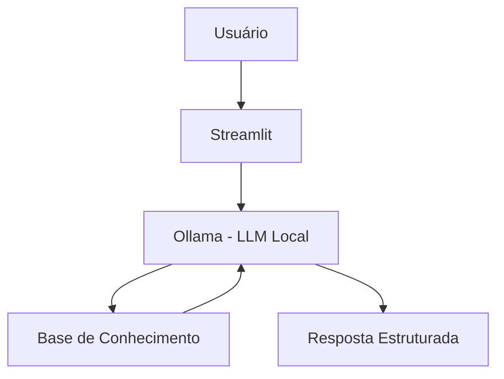

# 🎓 Luna - Assistente Inteligente de Organização Financeira

Agente de IA Generativa que ajuda usuários a organizar o orçamento mensal e entender seus hábitos de consumo de forma clara, estruturada e motivadora.
## 💡 O Que é a Luna?
A Luna é uma assistente digital focada em organização financeira. Ela não recomenda investimentos e não oferece crédito. Seu objetivo é transformar números em clareza. A Luna analisa renda, despesas e metas para ajudar o usuário a visualizar melhor como o dinheiro está sendo distribuído ao longo do mês.

**O que o Luna faz:**
>- ✅Classifica despesas (moradia, alimentação, transporte, lazer, etc.)
>- ✅ Calcula totais e percentuais automaticamente
>- ✅ Compara gastos com métodos como 50-30-20
>- ✅ Ajuda a organizar metas financeiras
>- ✅ Incentiva hábitos financeiros mais conscientes

**O que o Luna NÃO faz:**
>- ❌ Não recomenda investimentos
>- ❌ Não oferece empréstimos ou crédito
>- ❌ Não acessa dados bancários reais
>- ❌ Não substitui um planejador financeiro
>- ❌ Não substitui um profissional certificado

## 🏗️ Arquitetura



**Stack:**
- Interface: Streamlit
- LLM: Ollama (modelo local gpt-oss)
- Dados: JSON/CSV mockados
- Processamento: Python (cálculo de categorias e percentuais)

## 📁 Estrutura do Projeto

```
├── data/                          # Base de conhecimento
│   ├── perfil_usuario.json        # Dados básicos do usuário
│   ├── gastos_mensais.csv         # Histórico de despesas
│   ├── metas_financeiras.json     # Objetivos financeiros
│   └── historico_interacoes.csv   # Conversas anteriores
│
├── docs/                          # Documentação completa
│   ├── 01-documentacao-agente.md  # Caso de uso e persona
│   ├── 02-base-conhecimento.md    # Estratégia de dados
│   ├── 03-prompts.md              # System prompt e exemplos
│   ├── 04-metricas.md             # Avaliação de qualidade
│   └── 05-pitch.md                # Apresentação do projeto
│
└── src/
    └── app.py                     # Aplicação Streamlit
```

## 🚀 Como Executar

### 1. Instalar Ollama

```bash
# Baixar em: ollama.com
ollama pull gpt-oss
ollama serve
```

### 2. Instalar Dependências

```bash
pip install streamlit pandas requests
```

### 3. Rodar o Edu

```bash
streamlit run src/app.py
```

## 🎯 Exemplo de Uso

**Pergunta:** "Quanto estou gastando este mês?"
Luna:
"Você está gastando R$ 2.605,90 neste mês.
Isso representa cerca de 62% da sua renda mensal de R$ 4.200.
Quer que eu analise como esse valor está distribuído entre gastos fixos e variáveis?"

**Pergunta:** "Estou gastando muito com lazer?"
Luna:
"Seus gastos com lazer somam R$ 240, o que representa aproximadamente 5,7% da sua renda.
Isso está dentro de um limite saudável. A questão é: esse valor está alinhado com suas prioridades atuais?"

## 📊 Métricas de Avaliação
| Métrica           | Objetivo                                                               |
| ----------------- | ---------------------------------------------------------------------- |
| **Assertividade** | A Luna responde exatamente o que foi perguntado, com valores corretos? |
| **Segurança**     | Ela respeita suas limitações e não inventa dados?                      |
| **Coerência**     | A análise faz sentido com os números e com seu papel educativo?        |


## 🎬 Diferenciais
- Foco em organização: Não vende produtos, apenas organiza e explica.
- Clareza visual: Trabalha com percentuais e comparações simples.
- Personalização: Usa os próprios números do usuário como exemplo.
- 100% Local: Pode rodar com LLM local via Ollama.
- Segurança: Atua somente com dados fornecidos no contexto.

## 📝 Documentação Completa

Toda a documentação técnica, estratégias de prompt e casos de teste estão disponíveis na pasta [`docs/`](./docs/).
